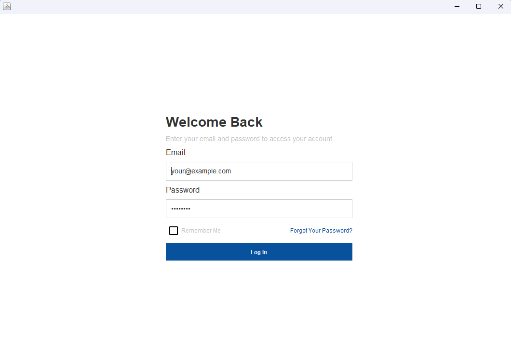

# User Login GUI

A simple GUI project to study `Swing` and `Awt` libs from Java.

## Features

The Login Screen have some components from `Swing`:

- `JLabel` - That provide a text.
- `JTextField` - A text field that receive data from the user.
- `JCheckbox` - A checkbox input.
- `JButton` - Button.

## Layout

I used `GridBagLayout` to provide a more dynamic layout to the screen.

## Preview

