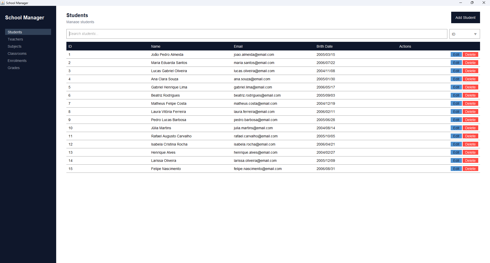

# School Manager

A desktop school management application built with **Java Swing**, **JDBC**, and **MySQL**. The project provides a graphical interface for managing the main entities of a school while demonstrating a layered Java application architecture and relational database integration.

## Preview



## Overview

School Manager was created as an intermediate Java project focused on building a complete desktop CRUD application from the database layer to the user interface.

The application centralizes common school-management operations in a single Swing interface, with dedicated screens for students, teachers, subjects, classrooms, enrollments, and grades.

## Objectives

- Practice Java application development beyond the command line.
- Build a desktop GUI with Java Swing.
- Integrate Java with MySQL through JDBC.
- Apply a layered architecture separating UI, application, service, repository, and model responsibilities.
- Implement complete CRUD workflows.
- Work with relational data and foreign-key constraints.
- Handle validation and user-friendly error messages.
- Use Docker to provide a reproducible MySQL development environment.
- Build reusable Swing components and consistent interfaces across the application.

## Features

### Students

- List all students.
- Create new students.
- Edit existing students.
- Delete students.
- Search by ID, name, email, and birth date.
- Validate required fields and input formats.

### Teachers

- List all teachers.
- Create new teachers.
- Edit existing teachers.
- Delete teachers.
- Search by ID, name, and email.

### Subjects

- List all subjects.
- Create new subjects.
- Edit existing subjects.
- Delete subjects.
- Search by ID and name.
- Optional subject descriptions.

### Classrooms

- Create and manage classrooms.
- Associate each classroom with a teacher and subject.
- Search by ID, name, teacher ID, and subject ID.
- Validate referenced entities before persistence.

### Enrollments

- Enroll students in classrooms.
- Edit and delete enrollments.
- Search by ID, student ID, classroom ID, and enrollment date.
- Enforce the student/classroom relationship in the database.
- Prevent duplicate enrollment of the same student in the same classroom.

### Grades

- Create, edit, and delete grades.
- Associate grades with enrollments.
- Search by ID, enrollment ID, value, and assessment.
- Validate that the referenced enrollment exists.
- Support decimal grade values.

## Architecture

The project follows a layered structure:

```text
com.schoolmanager
├── application
├── config
├── model
├── repository
├── service
└── ui
```

### Model

Contains the domain entities:

- `Student`
- `Teacher`
- `Subject`
- `Classroom`
- `Enrollment`
- `Grade`

### Repository

Responsible for database access through JDBC.

Each main entity has a repository interface and implementation, keeping SQL and persistence logic separated from the rest of the application.

### Service

Contains business rules and validation that should be handled before persistence, including relationship checks such as verifying that a referenced student, teacher, classroom, subject, or enrollment exists.

### Application

Provides the application-level API used by the Swing UI, keeping UI components independent from the repository implementations.

### UI

Contains the Swing interface, including:

- `MainFrame`
- `NavigationPanel`
- Entity panels
- Entity form dialogs
- Reusable input components

The main window uses a `CardLayout` to switch between management screens.

## Database

The application uses **MySQL** as its relational database.

The schema contains the following tables:

```text
students
teachers
subjects
classrooms
enrollments
grades
```

Relationships include:

```text
Teacher ────────┐
                ├── Classroom ──── Enrollment ──── Grade
Subject ────────┘                       │
                                        │
                                     Student
```

Foreign keys are used to maintain referential integrity, and the enrollment table prevents duplicate student/classroom combinations.

Grades are configured with `ON DELETE CASCADE` so that grades belonging to a deleted enrollment are removed automatically.

## Technologies

| Technology | Purpose |
|---|---|
| Java 25 | Application development |
| Java Swing | Desktop graphical user interface |
| JDBC | Database connectivity |
| MySQL | Relational database |
| Maven | Build and dependency management |
| Docker | Local database environment |
| Docker Compose | MySQL container orchestration |
| Git / GitHub | Version control and source hosting |

### Main dependency

- MySQL Connector/J `9.7.0`

## Project Structure

```text
school-manager/
├── src/
│   └── main/
│       ├── java/
│       │   └── com/
│       │       └── schoolmanager/
│       │           ├── application/
│       │           ├── config/
│       │           ├── model/
│       │           ├── repository/
│       │           ├── service/
│       │           └── ui/
│       └── resources/
│           ├── database.properties.example
│           └── schema.sql
├── docs/
│   └── preview.svg
├── .env.example
├── docker-compose.yml
└── pom.xml
```

## Getting Started

### Prerequisites

Make sure you have installed:

- Java 25 or later
- Maven
- Docker
- Docker Compose

### 1. Clone the repository

```bash
git clone https://github.com/evertonpontes/java-studies.git
cd java-studies/intermediate/school-manager
```

### 2. Configure the environment

Create a `.env` file based on `.env.example`:

```env
MYSQL_ROOT_PASSWORD=your_root_password
MYSQL_DATABASE=school_manager
MYSQL_USER=your_user
MYSQL_PASSWORD=your_password
```

Create the database connection properties based on:

```text
src/main/resources/database.properties.example
```

For a local setup, the configuration follows this structure:

```properties
db.url=jdbc:mysql://localhost:3306/school_manager
db.user=your_user
db.password=your_password
```

### 3. Start MySQL

```bash
docker compose up -d
```

The Compose configuration starts MySQL on port `3306` and mounts the project schema so the database can be initialized automatically.

### 4. Build the application

```bash
mvn clean compile
```

### 5. Run the application

```bash
mvn exec:java
```

The application opens the **School Manager** desktop interface.

## Database Schema

The SQL schema is located at:

```text
src/main/resources/schema.sql
```

The schema is responsible for creating the application's tables, primary keys, foreign keys, timestamps, and relationship constraints.

## CRUD Workflow

Each management screen follows a consistent workflow:

```text
List → Search → Create → Edit → Delete
```

The UI uses modal forms for create/edit operations and confirmation dialogs for destructive actions.

Search inputs are combined with a field selector, allowing the user to choose which attribute should be queried.

## UI Design

The interface follows a consistent visual system across the management screens, including:

- Dark navigation sidebar.
- Consistent typography and spacing.
- Reusable table styling.
- Search controls above each data table.
- Action buttons for editing and deleting records.
- Modal dialogs for data entry.
- Validation feedback through Swing dialogs.

## Learning Outcomes

This project demonstrates practical experience with:

- Object-oriented programming in Java.
- Swing GUI development.
- Event-driven desktop applications.
- JDBC and prepared statements.
- SQL CRUD operations.
- Relational database modeling.
- Foreign-key relationships.
- Layered application architecture.
- Input validation.
- Dependency management with Maven.
- Docker-based local development.

## License

This project is intended for educational and portfolio purposes.
